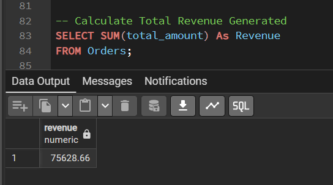
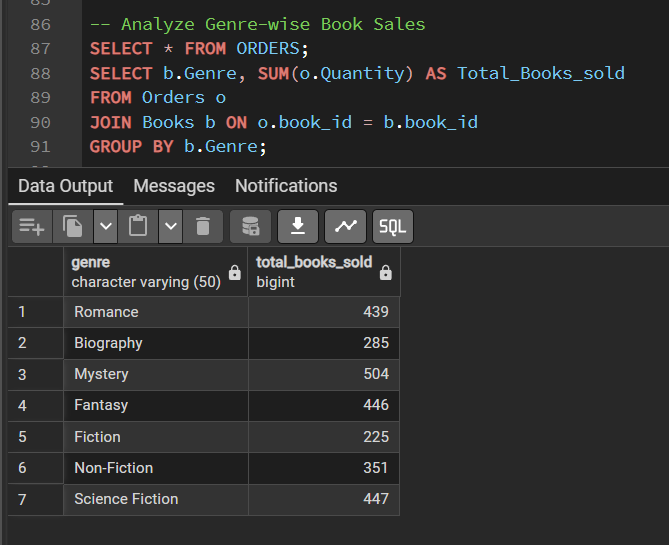
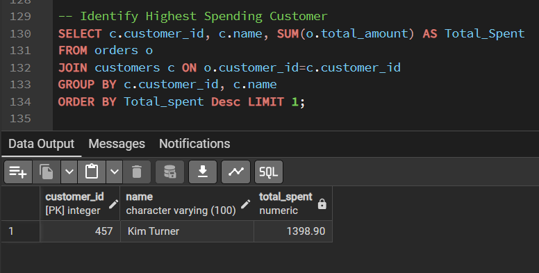
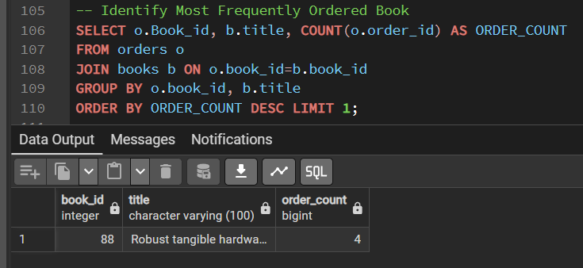
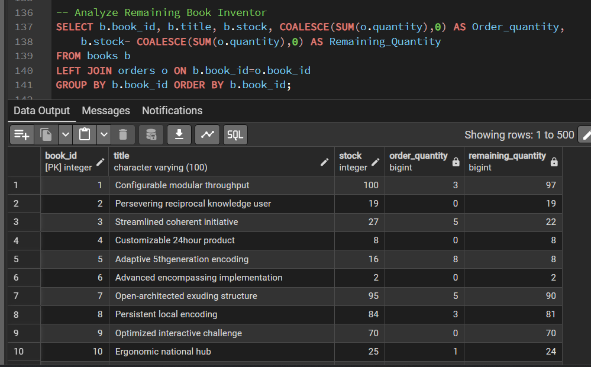

# Online Bookstore SQL Analysis

## Project Overview

This project analyzes an online bookstore database using SQL to identify sales trends, customer purchasing behavior, inventory performance, and revenue insights.

## SQL Concepts Used

- SELECT Statements
- WHERE Clause
- GROUP BY
- ORDER BY
- Aggregate Functions
- JOINS
- HAVING Clause
- Subqueries

## Key Analysis Performed

- Revenue Analysis
- Customer Spending Analysis
- Genre-wise Sales Analysis
- Inventory Analysis
- Most Frequently Ordered Books

## Sample Query Outputs

### Total Revenue Analysis

### Genre-wise Sales Analysis

### Highest Spending Customer

### Most Ordered Book

### Remaining Inventory Analysis

